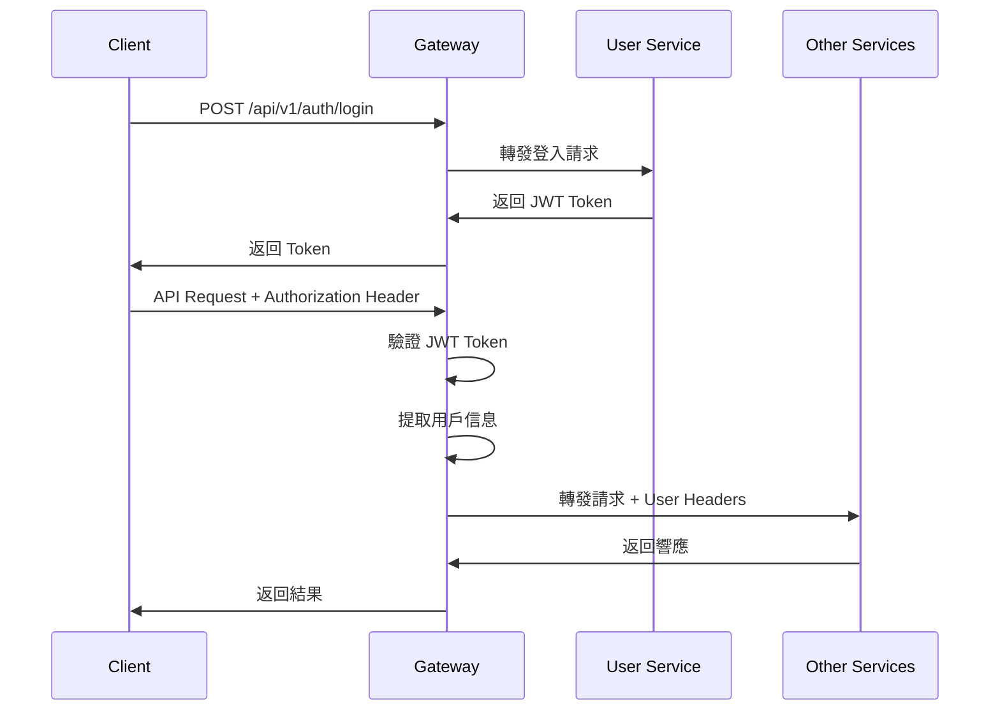

# API Gateway 架構文檔

## 🏗️ 整體架構概覽

本 API Gateway 採用現代化的 Go 架構設計，遵循清潔架構（Clean Architecture）原則，為智能報銷系統提供統一的微服務入口。

## 📁 項目結構

```
api-gateway/
├── cmd/                           # 應用程式入口
│   └── api/                      # 重命名自 server
│       └── main.go               # 主程式入口
├── internal/                      # 內部業務邏輯
│   ├── config/                   # 配置管理
│   │   └── config.go            # 配置結構和載入
│   ├── domain/                   # 🆕 領域模型層
│   │   ├── auth.go              # JWT 認證領域模型
│   │   ├── route.go             # 路由規則領域模型
│   │   └── errors.go            # 自定義錯誤類型
│   ├── dto/                      # 🆕 數據傳輸對象
│   │   ├── auth_dto.go          # 認證相關 DTO
│   │   └── response.go          # 統一響應格式
│   ├── handler/                  # HTTP 處理層
│   │   └── handler.go           # 現有處理器（待重構）
│   ├── middleware/               # 中間件層
│   │   ├── auth/                # 認證中間件（待實現）
│   │   ├── cors/                # CORS 處理
│   │   ├── logging/             # 日誌記錄
│   │   ├── ratelimit/           # 限流中間件（待實現）
│   │   └── security/            # 安全防護（待實現）
│   ├── service/                  # 業務邏輯層
│   │   ├── interfaces/          # 🆕 服務接口定義
│   │   ├── discovery/           # 服務發現
│   │   └── monitor/             # 監控統計
│   ├── repository/               # 🆕 數據存取層
│   │   └── interfaces/          # Repository 接口
│   ├── infrastructure/           # 🆕 基礎設施層
│   │   ├── jwt/                 # JWT 服務實現
│   │   └── proxy/               # HTTP 代理實現（待實現）
│   └── router/                   # 路由配置
├── pkg/                          # 公共工具包
│   ├── auth/                     # 🆕 JWT 工具包
│   ├── healthcheck/             # 健康檢查
│   └── validator/               # 🆕 驗證器（待實現）
├── configs/                      # 配置文件
│   ├── config.yaml              # 主配置
│   └── services.yaml            # 🆕 微服務路由配置
├── test/                         # 測試文件
└── docs/                         # 文檔
```

## 🎯 架構分層說明

### 1. Presentation Layer (表現層)
- **Location**: `internal/handler/`, `internal/dto/`
- **職責**: HTTP 請求處理、路由、中間件、數據轉換
- **特點**: 
  - 統一的 API 響應格式
  - JWT 認證處理
  - 請求驗證和數據綁定

### 2. Business Layer (業務層)
- **Location**: `internal/service/`, `internal/domain/`
- **職責**: 業務邏輯、用例實現、領域規則
- **特點**:
  - JWT Token 管理
  - 路由規則匹配
  - 服務發現邏輯
  - 監控統計

### 3. Data Layer (數據層)
- **Location**: `internal/repository/`, `internal/infrastructure/`
- **職責**: 數據存取、外部服務調用
- **特點**:
  - 配置文件讀取
  - 微服務代理轉發
  - 健康檢查

### 4. Shared Layer (共享層)
- **Location**: `pkg/`, `internal/config/`
- **職責**: 可重用工具、配置管理
- **特點**:
  - JWT 工具庫
  - 健康檢查工具
  - 配置結構定義

## 🔄 微服務架構

### 微服務列表
```yaml
services:
  - user-service (Laravel)     # Port 8081 - 用戶管理
  - expense-service (Laravel)  # Port 8082 - 報銷核心
  - approval-service (Laravel) # Port 8083 - 審核流程
  - finance-service (Laravel)  # Port 8084 - 財務管理
  - file-service (Go)         # Port 8085 - 檔案處理
  - ai-service (Go)           # Port 8086 - AI 智能處理
  - notification-service (Go) # Port 8087 - 通知系統
```

### 路由規則
```
/api/v1/auth/*        → user-service:8081
/api/v1/users/*       → user-service:8081
/api/v1/expenses/*    → expense-service:8082
/api/v1/approvals/*   → approval-service:8083
/api/v1/finance/*     → finance-service:8084
/api/v1/files/*       → file-service:8085
/api/v1/ai/*          → ai-service:8086
/api/v1/notifications/* → notification-service:8087
```

## 🔐 認證架構

### JWT Token 流程


### Header 傳遞
Gateway 驗證 JWT 後，設置以下 Headers 轉發給後端服務：
```
X-User-ID: {user_id}
X-Company-ID: {company_id}
X-User-Role: {role}
X-User-Email: {email}
```

## 🚀 已實現功能

### ✅ 完成項目
1. **目錄結構重組** - 遵循現代 Go 架構
2. **領域模型設計** - Auth, Route, Error 領域
3. **JWT 基礎設施** - 完整的 JWT 管理系統
4. **配置管理增強** - 支持微服務路由配置
5. **統一響應格式** - 標準化 API 響應
6. **微服務路由配置** - services.yaml 配置檔案

### 🔄 進行中項目
1. **認證中間件** - JWT 驗證中間件
2. **代理服務重構** - 基於新架構的代理實現
3. **路由解析器** - 動態路由配置載入
4. **限流中間件** - 基於新架構的限流實現

### ⏳ 待實現項目
1. **檔案上傳代理** - 大檔案串流處理
2. **健康檢查增強** - 微服務健康狀態監控
3. **監控指標擴展** - 更詳細的業務指標
4. **負載均衡器** - 多實例負載分配
5. **熔斷器** - 服務故障保護

## 🔧 核心特性

### 1. 智能路由
- 基於 Pattern 的路由匹配
- 支持萬用字元路由 (`/*`)
- 角色基礎的存取控制
- 動態路由配置重載

### 2. JWT 認證
- HS256 簽名演算法
- Token 過期檢查
- 用戶信息提取
- Header 自動設置

### 3. 微服務代理
- HTTP 反向代理
- 請求/響應轉發
- 錯誤處理和重試
- 超時控制

### 4. 監控和觀測
- 請求統計
- 錯誤率追蹤
- 響應時間監控
- Prometheus 指標

## 🚦 部署架構

### 開發環境
```
[Client] → [Gateway:8080] → [Microservices:808x]
```

### 生產環境 (規劃)
```
[Load Balancer] → [Gateway Cluster] → [Service Mesh] → [Microservices]
```

## 📊 性能考量

### 1. 連接池
- HTTP Client 連接重用
- 合理的超時設置
- 連接數限制

### 2. 快取策略
- JWT Token 快取 (可選)
- 路由配置快取
- 健康檢查結果快取

### 3. 限流保護
- IP 級別限流
- 用戶級別限流
- API 端點限流

## 🔄 擴展性設計

### 1. 水平擴展
- 無狀態設計
- 配置外部化
- 負載均衡支援

### 2. 插件架構
- 中間件鏈
- 自定義處理器
- 動態配置重載

### 3. 服務發現
- 靜態配置 (當前)
- Consul 整合 (規劃)
- Kubernetes Service Discovery (規劃)

## 📝 開發指南

### 添加新的微服務
1. 在 `configs/services.yaml` 添加服務配置
2. 定義路由規則
3. 設置健康檢查端點
4. 重啟或重載配置

### 添加新的中間件
1. 在 `internal/middleware/` 創建中間件
2. 實現 `gin.HandlerFunc` 接口
3. 在路由中註冊中間件
4. 添加配置選項

### 擴展認證機制
1. 在 `internal/domain/auth.go` 擴展認證模型
2. 在 `pkg/auth/` 實現認證邏輯
3. 更新 JWT Claims 結構
4. 修改認證中間件

這個架構為智能報銷系統提供了穩健、可擴展的 API Gateway 基礎，支持現代微服務架構的各種需求。
